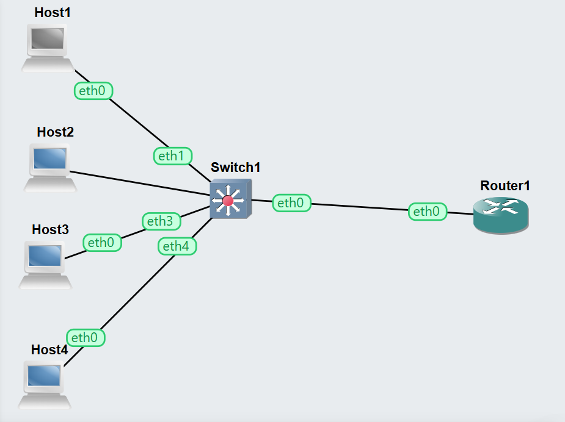
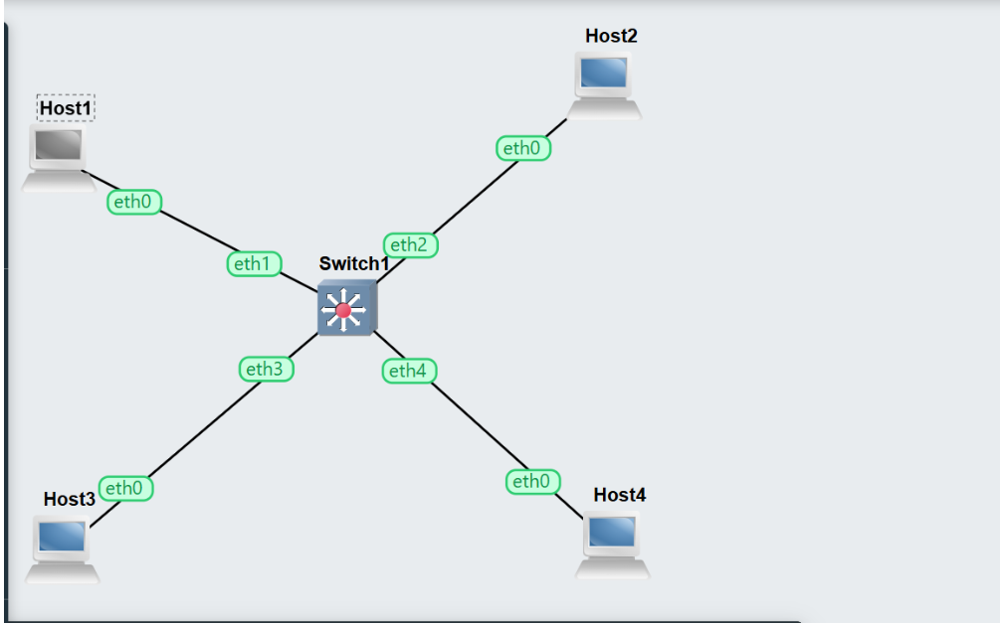

# Task 1: VLAN Configuration on Switch

## Aim
To learn how to configure VLANs on a managed switch using OpenvSwitch.

## Network Setup
- Project: Vlan-Basics-12314526
- Devices:
  - 4 Linux Hosts
  - 1 OpenvSwitch

## IP Configuration
All hosts were configured in the same subnet:

- Host1: 10.1.1.1
- Host2: 10.1.1.2
- Host3: 10.1.1.3
- Host4: 10.1.1.4

## VLAN Configuration

Based on student ID (12314526), VLAN IDs used:

- VLAN 526 → Host1 & Host2
- VLAN 527 → Host3 & Host4

## Commands Used

ovs-vsctl set port eth1 tag=526  
ovs-vsctl set port eth2 tag=526  
ovs-vsctl set port eth3 tag=527  
ovs-vsctl set port eth4 tag=527  

## Observation

- Hosts in same VLAN could communicate
- Hosts in different VLANs could NOT communicate
- VLANs successfully isolated traffic

---

# Task 2: VLAN Routing (Inter-VLAN Routing)

## Aim
To configure a router to allow communication between VLANs.

## Network Setup
- Project: Vlan-Router-12314526
- Devices:
  - 4 Hosts
  - 1 OpenvSwitch
  - 1 Linux Router

## IP Configuration

### VLAN 526
- Host1: 10.1.1.1
- Host2: 10.1.1.2

### VLAN 527
- Host3: 10.1.2.1
- Host4: 10.1.2.2

## Switch Configuration (Trunk Port)

ovs-vsctl set port eth0 trunks=[]

## Router Configuration

### Create VLAN interfaces

ip link add link eth0 name eth0.526 type vlan id 526  
ip link add link eth0 name eth0.527 type vlan id 527  

### Assign IP addresses

ip address add 10.1.1.254/24 dev eth0.526  
ip address add 10.1.2.254/24 dev eth0.527  

### Enable interfaces

ip link set eth0.526 up  
ip link set eth0.527 up  

### Enable forwarding

sysctl net.ipv4.ip_forward=1  

## Observation

- All hosts were able to communicate
- Router successfully forwarded traffic between VLANs

---

# Key Learnings

- Learned VLAN segmentation
- Understood access vs trunk ports
- Learned inter-VLAN routing
- Understood how routers connect VLANs

---

# Reflection

This lab helped me understand how VLANs are used to divide a network into smaller logical segments. Initially, all hosts were in the same network, but after VLAN configuration, communication was restricted between groups.

The router configuration was very useful because it showed how communication between different VLANs is possible using inter-VLAN routing. This is a very important concept in real networks.

Overall, this lab improved my understanding of VLANs and network segmentation.

---

# Screenshots Required

 

